# TodoApp - Proyecto Integrador 4 (Henry)

Aplicación web SPA de gestión de tareas con autenticación de usuarios, persistencia en la nube, envío de notificaciones por email y deploy en producción, desarrollada como Proyecto Integrador del Módulo 4 de Henry (MateCode).

**URL de producción:** https://todoapp-pied-ten.vercel.app

**Repositorio:** https://github.com/shakatoti1618-wq/proyecto-henry-modulo-4-todoapp-Jonathan-Heredia-

## Descripción del proyecto

MateCode es una startup que desarrolla aplicaciones web para pequeñas empresas. Este proyecto resuelve la necesidad de un cliente de contar con una app para que sus empleados gestionen tareas diarias de forma organizada, persistente y accesible desde cualquier dispositivo.

## Capturas
### INICIO DE SESION - INICIO DE SESION CON GOOGLE
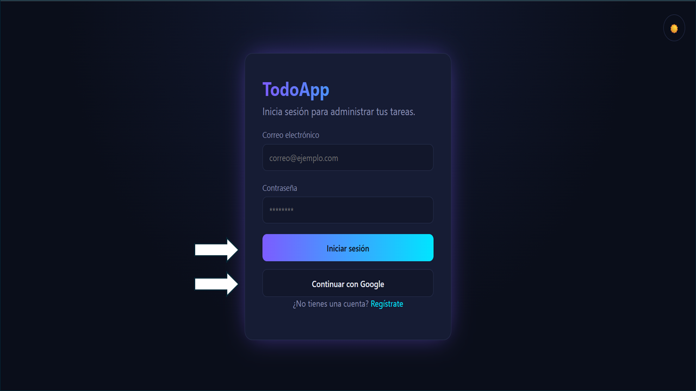
### REGISTRO
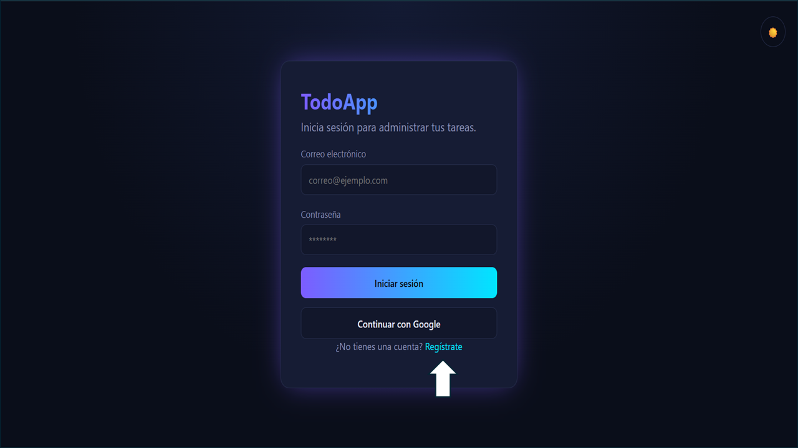
### CREAR CUENTA
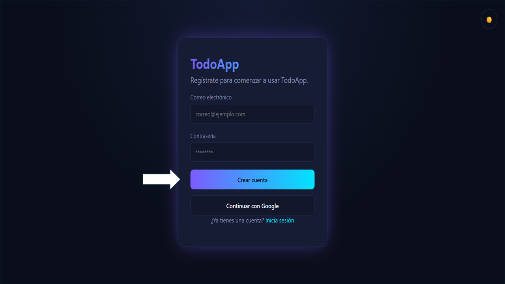
### TAREA Y DESCRIPCION
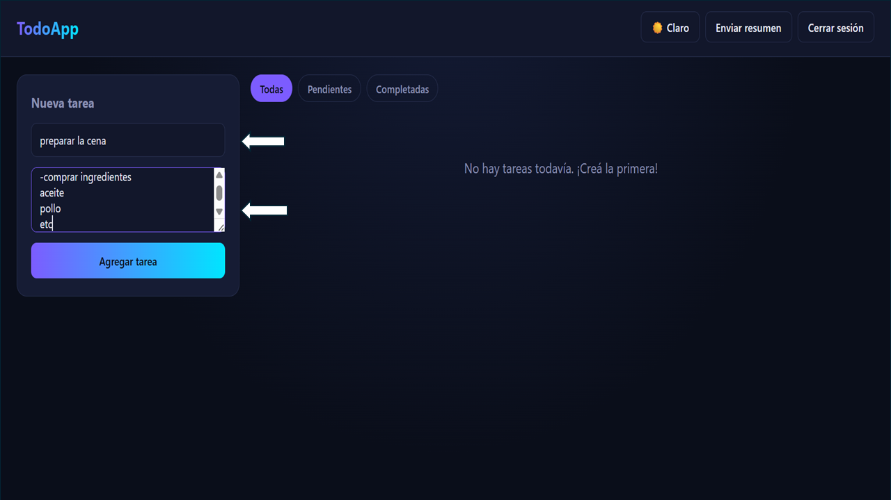
### AGREGAR TAREA
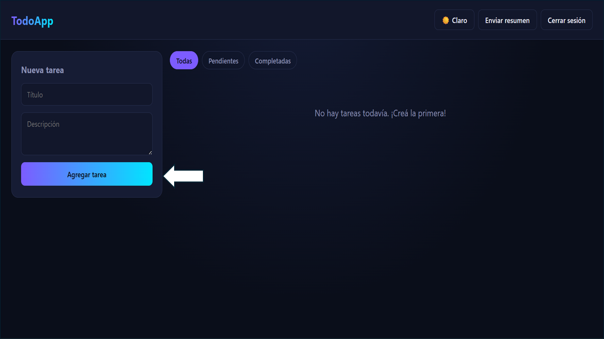
### TAREA COMPLETADA
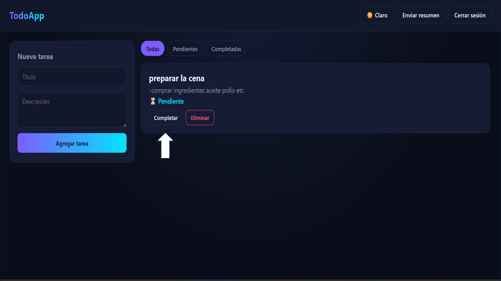
### ELIMINAR TAREA
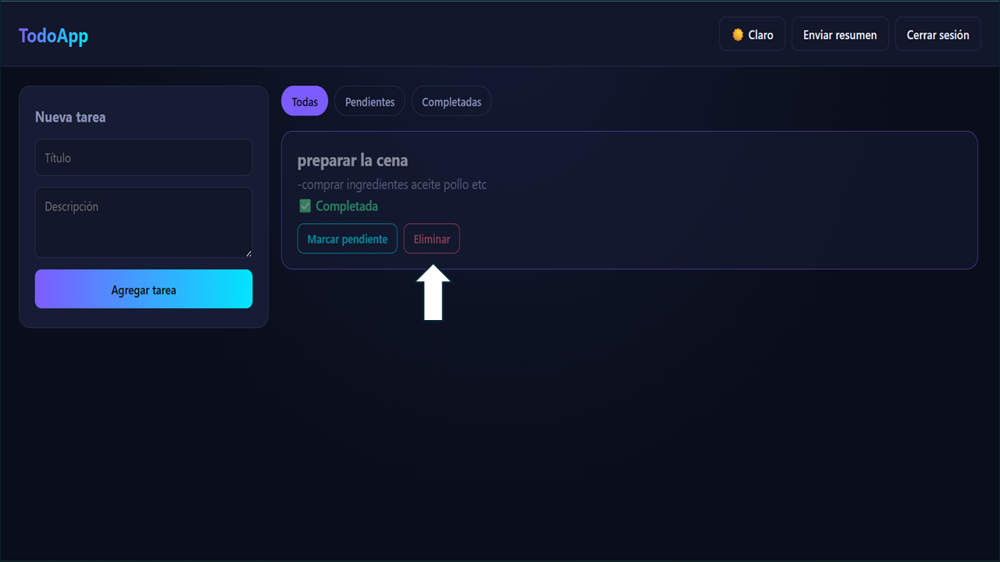
### TAREAS PENDIENTES
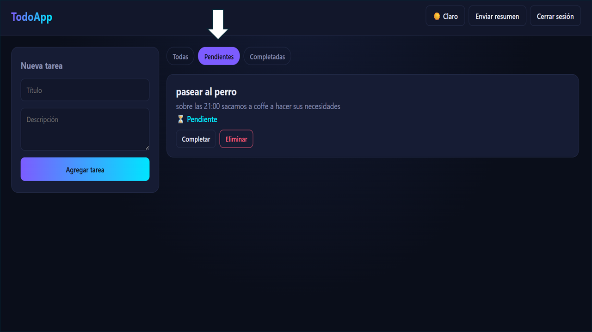
### TAREAS COMPLETADAS
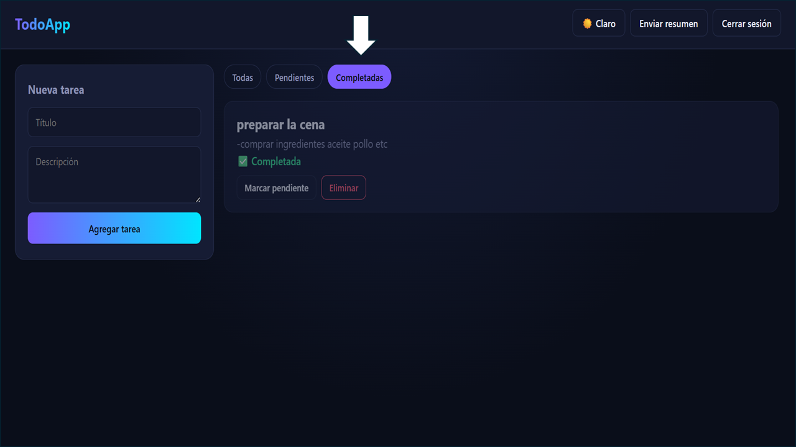
### ENVIAR RESUMEN POR EMAIL
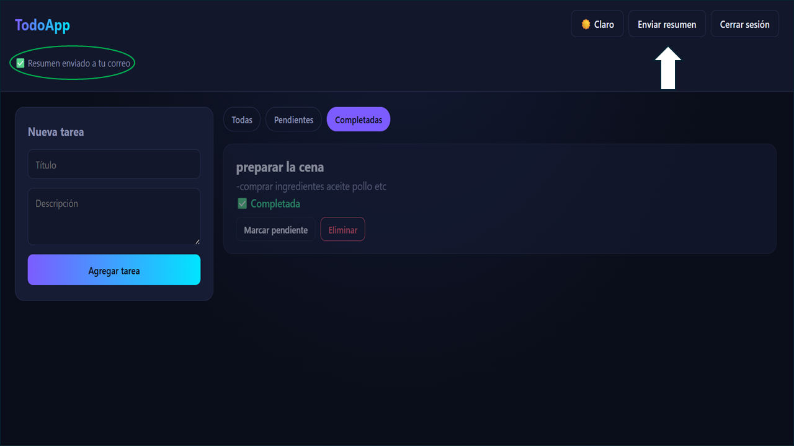
### EMAIL RECIBIDO
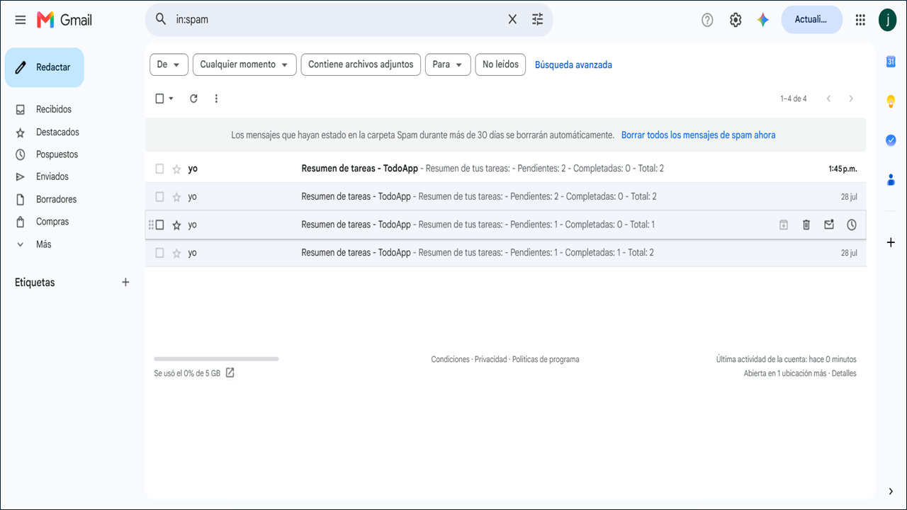
### EMAIL RECIBIDO
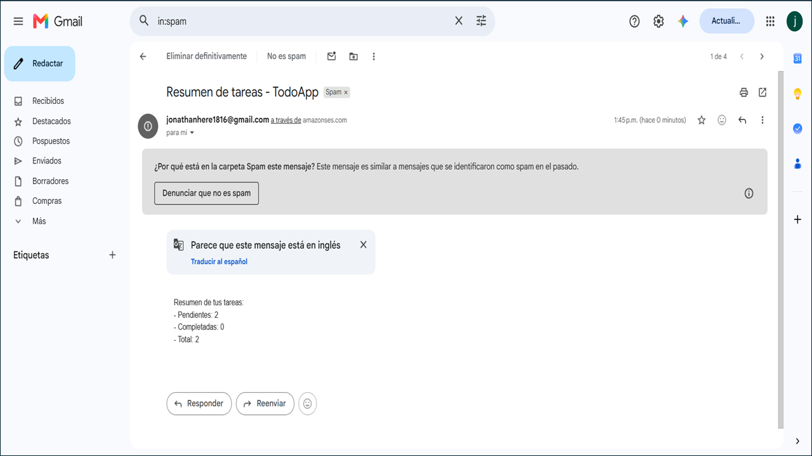
### CERRAR SESION
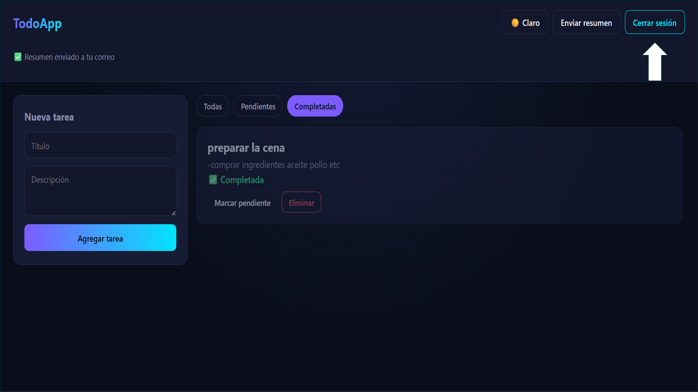
### MODO OSCURO
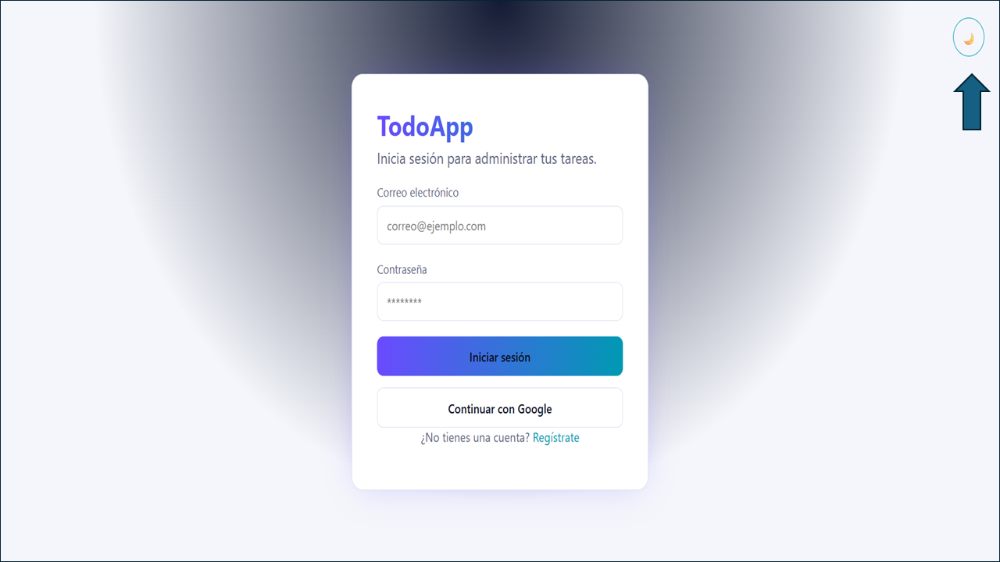

### Funcionalidades

- Registro e inicio de sesión con email/contraseña y con Google.
- Rutas protegidas: solo usuarios autenticados acceden al Dashboard.
- CRUD completo de tareas (crear, editar, eliminar, marcar como completada), persistido en Firestore y sincronizado en tiempo real.
- Cada usuario solo puede ver y modificar sus propias tareas (reglas de seguridad de Firestore).
- Envío de un resumen de tareas por email mediante una función serverless que usa AWS SES.
- Filtro de tareas por estado (todas / pendientes / completadas).
- Modo claro/oscuro con diseño responsive (mobile, tablet y desktop).
- Tests unitarios y de componentes con Vitest + React Testing Library.
- Deploy continuo en Vercel conectado al repositorio de GitHub.

## Stack

- **Frontend:** React 19 + TypeScript + Vite
- **Backend as a Service:** Firebase (Authentication + Firestore)
- **Notificaciones:** AWS SES, invocado desde una Vercel Function
- **Testing:** Vitest + React Testing Library
- **Deploy:** Vercel

## Estructura del proyecto

```
todoapp/
├─ api/
│  └─ send-summary.ts          # Función serverless (Vercel) — envío de email vía AWS SES
├─ docs/                        # Capturas de pantalla para el README
├─ src/
│  ├─ components/
│  │  ├─ Footer/
│  │  │  ├─ Footer.tsx
│  │  │  └─ Footer.css
│  │  ├─ ProtectedRoute/
│  │  │  ├─ ProtectedRoute.tsx
│  │  │  └─ ProtectedRoute.css
│  │  └─ tasks/
│  │     ├─ TaskForm.tsx
│  │     ├─ TaskForm.css
│  │     ├─ TaskForm.test.tsx
│  │     ├─ TaskItem.tsx
│  │     ├─ TaskItem.css
│  │     ├─ TaskList.tsx
│  │     └─ TaskList.test.tsx
│  ├─ hooks/
│  │  ├─ useTasks.ts            # Lógica de estado del CRUD (Firestore + onSnapshot)
│  │  └─ useTheme.ts            # Toggle de modo claro/oscuro
│  ├─ pages/
│  │  ├─ Login.tsx
│  │  ├─ Register.tsx
│  │  ├─ Auth.css
│  │  ├─ Dashboard.tsx
│  │  ├─ Dashboard.css
│  │  └─ NotFound.tsx
│  ├─ routes/
│  │  └─ AppRouter.tsx          # Definición de rutas + ProtectedRoute
│  ├─ services/
│  │  ├─ firebase.ts            # Inicialización de Firebase
│  │  ├─ auth.ts                # Login, registro, Google, logout
│  │  ├─ tasks.ts                # CRUD de tareas en Firestore
│  │  ├─ tasks.test.ts
│  │  └─ email.ts               # Llamada al endpoint /api/send-summary
│  ├─ types/
│  │  └─ Task.ts                # Interface Task compartida
│  ├─ App.tsx
│  ├─ main.tsx
│  └─ index.css                 # Variables globales + reset + modo claro/oscuro
├─ .env                         # Local, NO se sube (ignorado por git)
├─ .env.example                 # Plantilla sin valores reales
├─ .gitignore
├─ vercel.json                  # Rewrites para SPA routing
├─ vite.config.ts
├─ vitest.setup.ts
├─ package.json
└─ README.md
```

## Decisiones arquitectónicas

- **Estructura por capas:** `pages/` (vistas), `components/` (UI reutilizable), `services/` (integraciones con Firebase y AWS), `hooks/` (lógica de estado reutilizable como `useTasks` y `useTheme`), `types/` (tipos compartidos como `Task`).
- **CRUD en tiempo real:** se usa `onSnapshot` de Firestore para que la interfaz se actualice automáticamente ante cualquier cambio, sin necesidad de recargar la página.
- **Seguridad por reglas de Firestore:** cada tarea guarda un `userId`. Las reglas verifican que `request.auth.uid` coincida con ese campo antes de permitir lectura, escritura o borrado, evitando que un usuario acceda a los datos de otro.
- **Función serverless para AWS SES:** las credenciales de AWS nunca se exponen en el frontend. El envío de email pasa por `/api/send-summary`, una función de Vercel que usa variables de entorno del lado del servidor (sin prefijo `VITE_`, por lo tanto inaccesibles desde el navegador).
- **CSS modular por componente:** cada componente/página tiene su propio archivo `.css`, con variables globales (`--bg`, `--accent`, `--text`, etc.) centralizadas en `index.css`, lo que permite mantener consistencia visual y soportar el modo claro/oscuro mediante el atributo `data-theme`.
- **Rewrites de SPA en Vercel:** se agregó `vercel.json` para redirigir cualquier ruta (excepto `/api/*`) a `index.html`, evitando errores 404 al recargar rutas internas como `/dashboard`.

## Instalación local

```bash
git clone https://github.com/shakatoti1618-wq/proyecto-henry-modulo-4-todoapp-Jonathan-Heredia-.git
cd proyecto-henry-modulo-4-todoapp-Jonathan-Heredia-
npm install
```

Creá un archivo `.env` en la raíz (usá `.env.example` como referencia) con tus propias credenciales de Firebase y AWS.

```bash
npm run dev      # levanta el frontend
vercel dev       # levanta frontend + función serverless (necesario para probar el envío de email)
npm run test     # corre los tests
```

## Variables de entorno necesarias


###VARIABLES DE ENTORNO
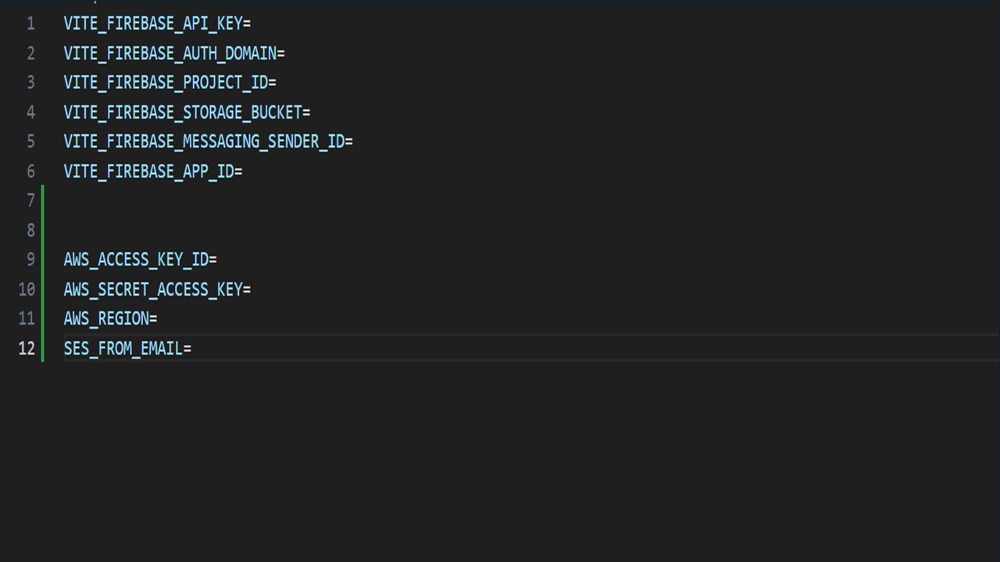

VITE_FIREBASE_API_KEY
VITE_FIREBASE_AUTH_DOMAIN
VITE_FIREBASE_PROJECT_ID
VITE_FIREBASE_STORAGE_BUCKET
VITE_FIREBASE_MESSAGING_SENDER_ID
VITE_FIREBASE_APP_ID
AWS_ACCESS_KEY_ID
AWS_SECRET_ACCESS_KEY
AWS_REGION
SES_FROM_EMAIL


Las variables con prefijo `VITE_` corresponden a la configuración pública de Firebase (no son secretas por diseño). Las variables de AWS se usan **exclusivamente** dentro de la función serverless (`api/send-summary.ts`) y nunca llegan al navegador.

## Flujo de envío de email

1. El usuario, autenticado y desde el Dashboard, hace click en "Enviar resumen".
2. El frontend envía un `POST` a `/api/send-summary` con su email y su lista de tareas.
3. La función serverless calcula cuántas tareas están pendientes/completadas y llama a AWS SES usando credenciales que solo existen en el entorno del servidor.
4. AWS SES envía el correo con el resumen.

**Nota:** la cuenta de AWS SES utilizada está en modo *sandbox*, por lo que únicamente puede enviar a direcciones de correo verificadas manualmente en la consola de SES. Para uso en producción real, se debería solicitar la salida del sandbox ante AWS.

## Testing

### TESTS
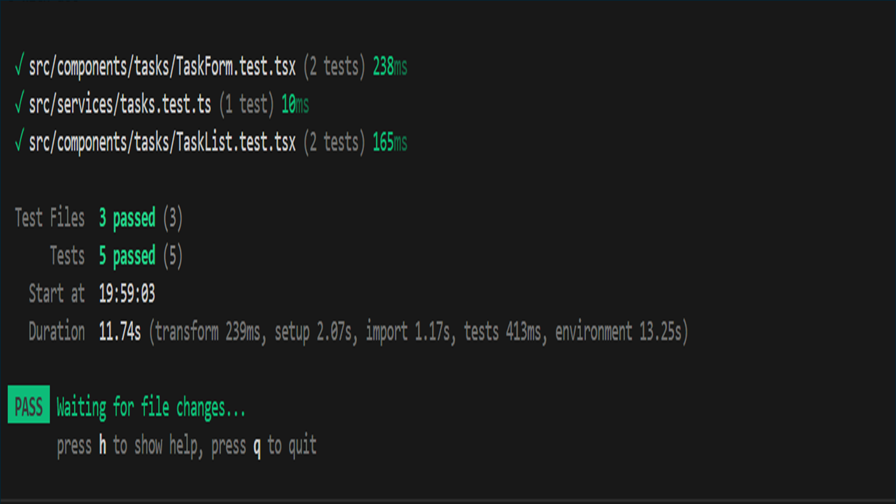

Se implementaron tests con Vitest y React Testing Library para:
- `TaskForm`: comportamiento al enviar el formulario y caso borde de título vacío.
- `TaskList`: renderizado de tareas y caso borde de lista vacía.
- `services/tasks.ts`: creación de tareas, mockeando Firebase para no depender de una conexión real.

```bash
npm run test
```

## Uso de IA en el desarrollo

###PROMPT USADOS
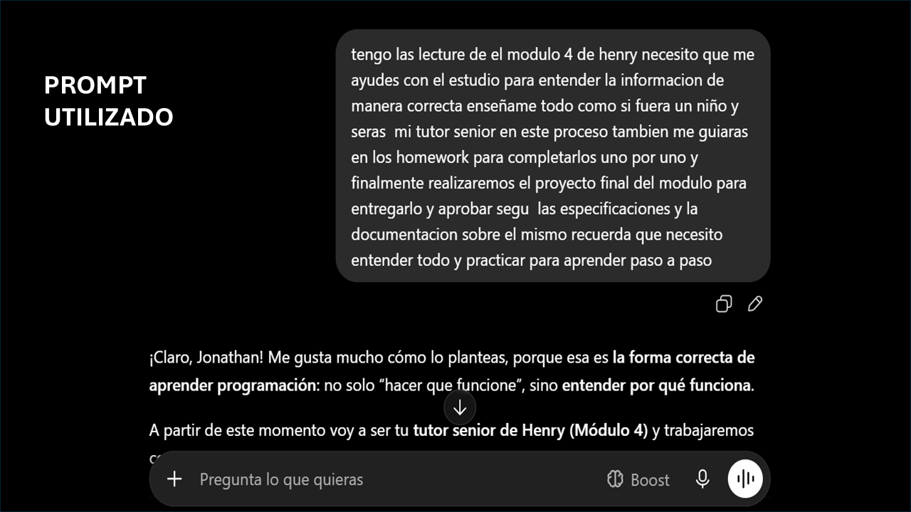
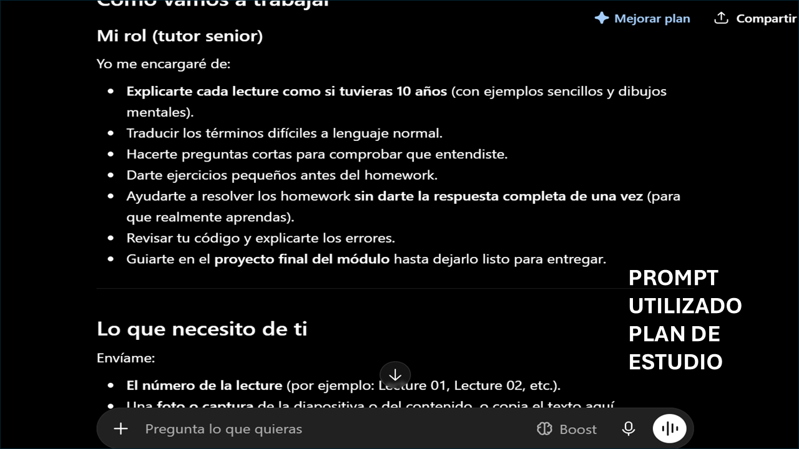
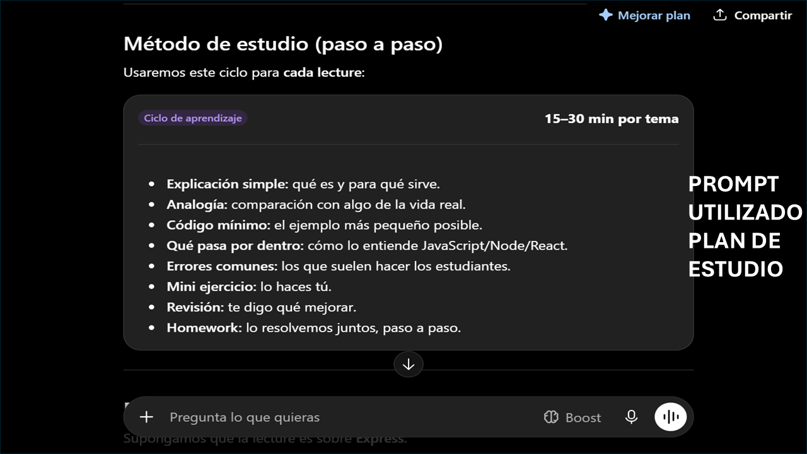
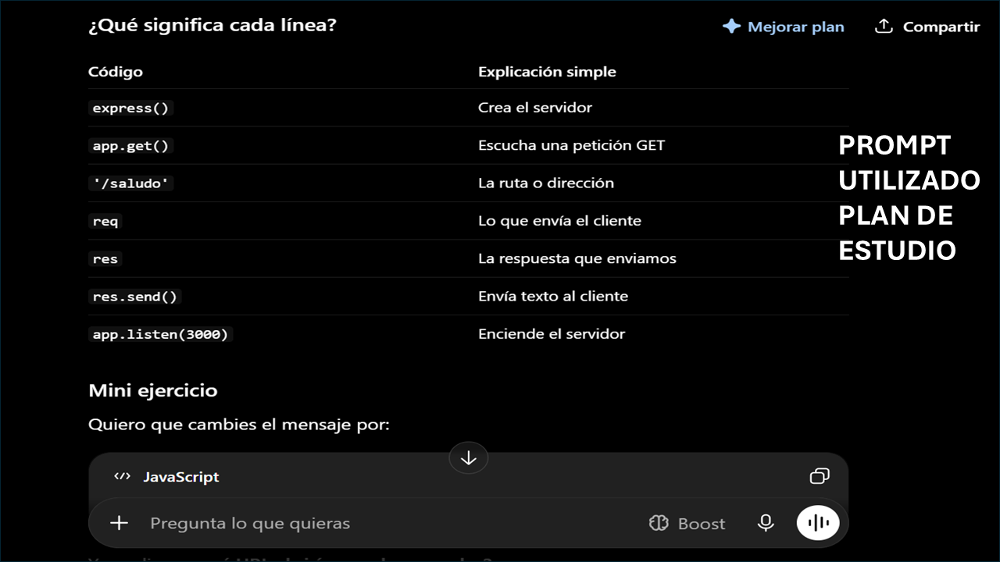


Utilicé un asistente de IA como apoyo durante el desarrollo, principalmente para:

- **Explicación de conceptos antes de implementarlos:** por ejemplo, entender qué resuelven las reglas de seguridad de Firestore, por qué AWS SES no puede llamarse directamente desde el navegador, o por qué Firestore pide un índice compuesto al combinar `where` + `orderBy`.
- **Guía paso a paso por hitos:** en vez de pedir el proyecto resuelto de una vez, fui avanzando hito por hito (setup, autenticación, CRUD, email, testing, estilos, deploy), aplicando y probando cada cambio yo mismo antes de pasar al siguiente.
- **Patrones aprendidos a partir de su uso:** separar la lógica de Firebase en `services/` en lugar de escribirla directo en los componentes; usar mocks en los tests para no depender de servicios externos reales; verificar explícitamente casos de seguridad (¿puede el usuario A ver tareas del usuario B?) en vez de asumir que las reglas configuradas funcionan correctamente.

Las decisiones finales de arquitectura y la validación de cada paso (compilación, pruebas manuales en el navegador, resultados de los tests) las realicé yo mismo antes de incorporar cada cambio al proyecto.

Licencia:

Proyecto académico desarrollado con fines educativos.

Jonathan Heredia

Proyecto Integrador Módulo 4

Henry Bootcamp

2026
